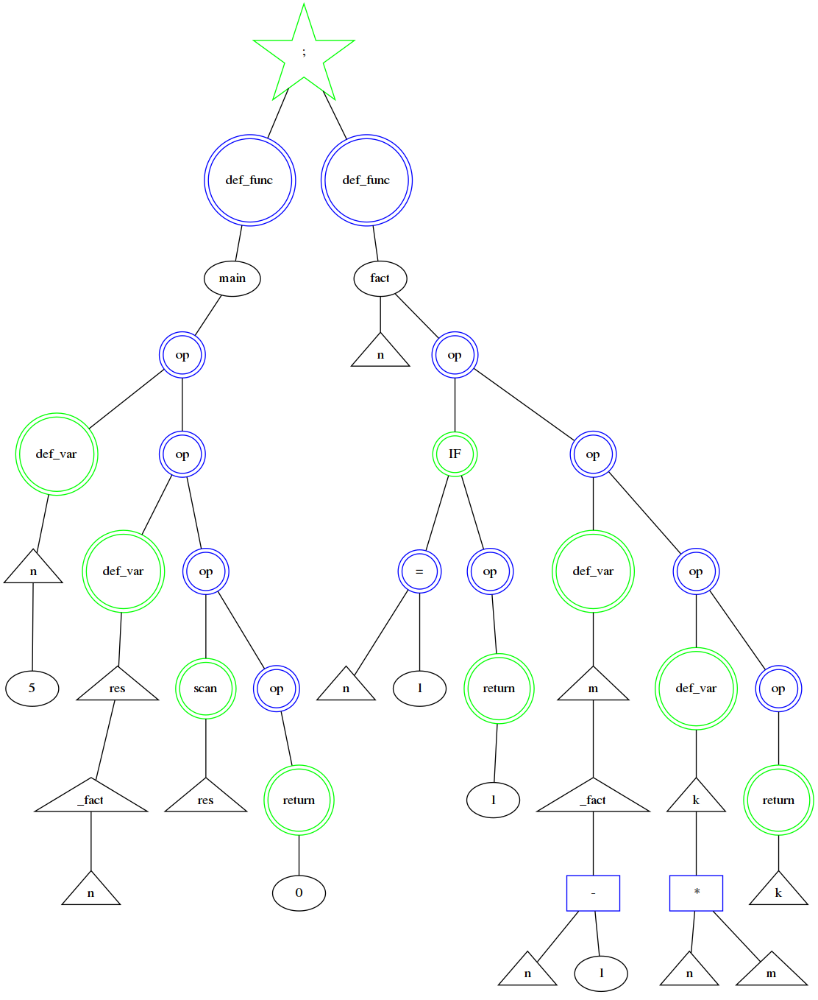

# The Cure language
\
Not only for ISP RAS but for everyone :)


## Description
C-like language, keywords can be changed in the [file](/frontend/language.h).\
Developed as part of a learning task for ISP RAS.
## Key words of the language
| System operation                |      Description        |
|:----------------------|:---------------------:|
|`the_cure     ` funcName()| function definition   |
|`a_strange_day (){}; `| `if`    |
|`boys_do_not_cry{};  `| `else`|
|`last_dance ... ;`| `return`      |
|`lullaby(){};  `| `while`   |
|`the_cure M(){ last_dance 0;};`| int `main`(){return 0;}             |
|`close_to_me(var or num);`| `in` var      |
|`to_the_sky(var or num);`| `out` var      |
|`cut_her();`| `cos `    |
|`secrets();`| `sin`      |
|`lovesong();`| `log`      |
|`forest a = 10;`| int a = 10;     |
|`_aaa();`| call expr of func aaa     |
|`equel`| == (some pain)   |


Now, you can use free variable only in () block or after +/-/*/^/div 

```bash
  the_cure  M ( ) {
    forest n = 5;
    forest res = _fact ( n ) ;
    to_the_sky( res ) ;
    last_dance (0) ;
 } ;

 the_cure  fact ( n ) {
     a_strange_day  ( n equel 1 ) {
         last_dance 1 ;
     } ;
     forest m = _fact ( n - 1 ) ;
     forest k = n * m ;
     last_dance ( k );
  } ;

 $
```
FACTORIAL(ASM)
```bash
tmain:
push 5
pop [0]
push [0]
push [0]
call ffact
pop [1]
pop [0]
push [1]
out
hlt

ffact:
pop [2]
push 1
push [2]
je tifCond0
tifTempCond1:
push [2]
push 1
push [2]
sub
call ffact
pop [3]
pop [2]
push [3]
push [2]
mul
pop [4]
push [4]
ret


tifCond0:
push 1
ret
jmp tifTempCond1

```
## Structure
- Frontend project 
    - frontend/
- Backend project
    - backend/
- GravizDump project
    - dumps/
- Examples project
    - examples/

## EXAMPLES
[See](examples) 

## RUN
./the_cure_language Input Output\
Input: file with language code\
Output: [assembly](https://github.com/vvdvortsova/cpu_assembler_disassembler) language file 
```bash

cmake .
make
./the_cure_language gr1.txt gr1Out.txt

//Due to my stack-mashine https://github.com/vvdvortsova/cpu_assembler_disassembler
cmake .
make
./asm asm.txt masm 
./stack_machine masm
```

## Grammar
```bash
Grammar:
G ::= D | E $
D ::= 'def' F '(' E ')' '{' Q '}' ';'
Q ::= S { ';' S } *
S ::= C|E|W|R
C ::= 'if' '(' B ')' '{' Q '}' { | 'else' '{' Q '}' } // if or if-else
B ::= E [<>|&] E
R ::= 'return' E
W ::= 'while' '(' E ')' { Q }
E ::= T{['+', '-']T}*| A
A ::= Var = E
T ::= POW{['*', '/']POW}*
POW ::= P{['^']P}*
P ::= '(' E ')' | N | F '(' E ')'
F ::= _[a-zA-z]*
N ::= ['0'-'9']+
```
## Warnings
There are some rules(fitches/bugs/I'll improve it somehow):
```bash
Put space after variables
To be succeeded put space everywhere :)
And put space befor new func:)
And put space befor and after variable
Now it is without optimization
Please don't laugh too much
Тут много что нужно порефакторить и убрать лишнее
+ backend не доделан, но я поняла как надо!:)
Но код с примером работает и компилируется 100%
Frontend тоже рабочий
Не сделала пример с квадратным уравнением, ибо надо добавить в язык корень(sqrt)
TODO: add while, if-else, sqrt, docs and testing of course
TODO: оптимизатор для getE
Да, с запятыми переборщила
Put comma after fuction def and do not foget about $
PS: Sorry for mix c/c++, because I just started writing in c++.
    The code will improve.
```
## Documentation
You can watch documentation by opening
```docs/html/index.html ``` in browser.

## OS
 KUbuntu 18.04