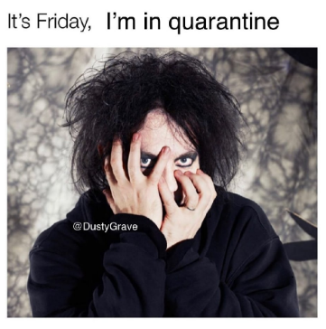

# The Cure language
Not only for ISP RAS but for everyone :)


## Description
C-like language, keywords can be changed in the [file](/frontend/language.h).\
Developed as part of a learning task for ISP RAS.
## Key words of the language
| System operation                |      Description        |
|:----------------------|:---------------------:|
|`the_cure     ` funcName()| function definition   |
|`a_strange_day (){} `| `if`    |
|`boys_do_not_cry{}  `| `else`|
|`last_dance`| `return`      |
|`lullaby(){}  `| `while`   |
|`the_cure M(){ last_dance 0;}`| int `main`(){return 0;}             |
|`close_to_me(var or num);`| `in` var      |
|`to_the_sky(var or num);`| `out` var      |
|`cut_her();`| `cos `    |
|`secrets();`| `sin`      |
|`lovesong();`| `log`      |
|`forest a = 10;`| int a = 10;     |
Now, you can use free variable only in () block or after +/-/*/^/div 

```bash
the_cure love ( n ) {
    forest a = 10;
 } ;

 the_cure M (  ) {
     forest b = 12;
  } ;

   the_cure flex (  ) {
       forest b = 12;
    } ;


   the_cure M ( c ) {
       forest l = 23;
    } ;
    $
```

##Grammar
```bash
Grammar:
G ::= D | E $
D ::= 'def' F '(' E ')' '{' Q '}' ';'
Q ::= S { ';' S } *
S ::= C|E|W|R
C ::= 'if' '(' B ')' '{' Q '}' { | 'else' '{' Q '}' } // if or if-else
B ::= E [<>|&] E
R ::= 'return' E
W ::= 'while' '(' E ')' { Q }
E ::= T{['+', '-']T}*| A
A ::= Var = E
T ::= POW{['*', '/']POW}*
POW ::= P{['^']P}*
P ::= '(' E ')' | N | F '(' E ')'
F ::= _[a-zA-z]*
N ::= ['0'-'9']+
```

## Documentation
You can watch documentation by opening
```docs/html/index.html ``` in browser.

## OS
 KUbuntu 18.04